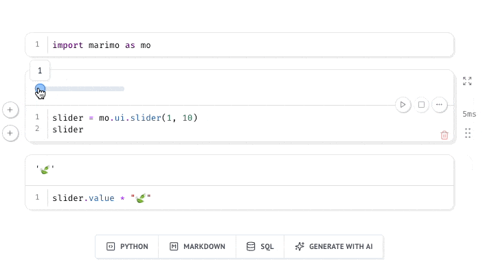

<p align="center">

</p>

<p align="center">
  <em>Embed interactive Python notebooks in static web pages, powered by <a href="https://github.com/marimo-team/marimo" target="_blank" rel="noopener">marimo</a> and WebAssembly</em>.
</p>

# marimo snippets


Bring code snippets to life with **marimo snippets**: a single-file JavaScript
utility that makes it easy to embed interactive Python notebooks in static web
pages.


**Highlights.**

- 📝 **markdown-compatible**: compatible with `mkdocs` and other markdown preprocessors.
- 🛠️ **extensible**: HTML-first design makes it easy to integrate with static site generators like Sphinx
- ⚙️  **configurable**: configure through HTML or JavaScript
- 🦋 **lightweight**: just one small script

## Quickstart for mkdocs users

**Try locally.** This repo contains an example (`src/index.md`) that you can
try locally; [install `uv`](https://docs.astral.sh/uv/), then run

```bash
make serve
```


### **Link to a playground notebook.** 

Use the `<marimo-button>` HTML element to
add a button that links to a marimo playground notebook, preloaded with Python
code.

````md
<div>
<marimo-button>
```python
def hello_world():
    print("Hello, World!")
```
</marimo-button>
<div>

<script src="https://cdn.jsdelivr.net/npm/@marimo-team/marimo-snippets@1"></script>
````

This is what it looks like:


### **Embed an interactive notebook inline.** 

`<marimo-iframe>` replaces
multiple code snippets with an inline marimo notebook, one cell per code
snippet.

````md
<div>
<marimo-iframe>
```python
import marimo as mo
```
```python
slider = mo.ui.slider(1, 10)
slider
```

```python
slider.value * "🍃"
```
</marimo-iframe>
</div>

<script src="https://cdn.jsdelivr.net/npm/@marimo-team/marimo-snippets@1"></script>
````

This will embed an iframe with an interactive slider. 



### **Mixed Python and Markdown cells**

You can combine Python and Markdown cells in the same notebook. Markdown cells are automatically detected and rendered as documentation:

````md
<div>
<marimo-iframe>
```md
# Markdown snippet example
## Imports
```
```python
import marimo as mo
```
```md
## Setup slider in UI and display it
```
```python
slider = mo.ui.slider(1, 10)
slider
```
```md
## This title is in Markdown and below is displaying value of 🍃 based on the slider
```
```python
slider.value * "🍃"
```
</marimo-iframe>
</div>

<script src="https://cdn.jsdelivr.net/npm/@marimo-team/marimo-snippets@1"></script>
````

This creates a notebook with alternating markdown documentation and Python code cells. Markdown cells are automatically imported as `marimo as mo` when needed.

> [!NOTE]  
> You might wonder why we wrap the `<marimo-button>` element with an extra
> `<div>`. This is related to how different markdown preprocessors might handle
> the custom HTML elements. To guarantee that this approach works across most
> markdown tools, we need to wrap the custom elements in a block element.

## Overview


marimo snippets lets you selectively convert code snippets, specifically
`<pre>` elements, to marimo notebooks.

These notebooks run via **WebAssembly**, meaning the browser executes Python
code (no backend required). Most packages are supported, including numpy,
scipy, scikit-learn, matplotlib, plotly, altair, polars, duckdb, and more.
Consult the [pyodide
documentation](https://pyodide.org/en/stable/usage/packages-in-pyodide.html)
for a list of supported packages.

### Loading the marimo snippets script

To get started, you'll need to load the marimo snippets script:

```html
<script src="https://cdn.jsdelivr.net/npm/@marimo-team/marimo-snippets@1"></script>
```

### Linking to the marimo playground

Add an "open-in-marimo" button to `pre` elements with `<marimo-button>`:

```html
<marimo-button>
<pre>
def hello_world():
    print("Hello, World!")
</pre>
</marimo-button>
```

This renders the `<pre>` element but adds a button that opens the code
in [the marimo playground](https://marimo.new).

### Open in an new tab

````md
This is a demo site.

```python
a = 1
b = 2
```

This adds a button that links to a marimo playground notebook preloaded
with Python code.

<div>
<marimo-button>
```python
def hello_world():
    print("Hello, World!")
```
</marimo-button>
</div>
````

### Using markdown

If you are using a static site generator like mkdocs, you can users code fences
instead of raw `<pre>` elements. You may need to wrap the entire block in a
`<div>`, and you may need to add the `md_in_html` extension.


## Integrating with other static site generators

Because of its HTML-first design, marimo snippets works out of the box with
many static site generators like mkdocs. However, marimo snippets does not work
out of the box with all SSGs; for example, it does not work out of the box with
Sphinx.

### MDX

marimo-snippets does not play well with MDX out of the box. To embed marimo
notebooks in MDX, see the [marimo
documentation](https://docs.marimo.io/guides/publishing/playground/#mdx).

### Contributing

To our community: **we'd love your help in developing plugins for other SSGs like
Sphinx** that target marimo snippets.

* If you develop a plugin, let us know and we'll link to it from our README.
* If you have questions while developing a plugin, reach out on GitHub issues.

marimo snippets is implemented as a wrapper around marimo's online playground.
In some cases, when building plugins for SSGs, you may be better served by generating
working with playground URLs directly, instead of using marimo-snippets. Consult
the marimo [docs on embedding playground
notebooks](https://docs.marimo.io/guides/publishing/playground/#embedding-in-other-web-pages)
to learn more.

## Configuration

marimo snippets can be configured in two ways: globally, or locally for individual snippets.

### Button configuration

Default button configuration:

```javascript
{
  elements: ['pre'],
  title: 'Open code in an interactive playground',
  position: 'absolute',
  top: '0.5rem',
  right: '0.5rem',
  border: 'none',
  borderRadius: '4px',
  padding: '4px 8px',
  margin: '-4px 22px',
  cursor: 'pointer',
  zIndex: '10',
  filter: 'grayscale(100%)',
  icon: '',
};
```

#### iframe configuration

Default iframe configuration:

```javascript
{
  elements: ['pre'],
  height: '400px',
  width: '100%',
  border: '1px solid #ddd',
  borderRadius: '4px',
  margin: '1rem 0',
  showCode: 'true',
  url: 'https://marimo.app',
  paramName: 'code'
};
```

### Global configuration

To configure snippets globally, include the following script element _before_ loading the marimo
snippets script.

```html
<!-- Optionally configure how buttons and iframes are rendered. -->
<!-- Configuration must come _before_ the main extractor script is loaded. -->
<script type="text/x-marimo-snippets-config">
configureMarimoButtons({title: "Open in a marimo notebook"});
configureMarimoIframes({height: "400px"});
</script>

<script src="https://cdn.jsdelivr.net/npm/@marimo-team/marimo-snippets@1"></script>
```

### Per-element configuration

To configure an a per-element basis, use data attributes:

```html
<marimo-iframe data-height="600px" data-show-code="false">
...
</marimo-iframe>
```
